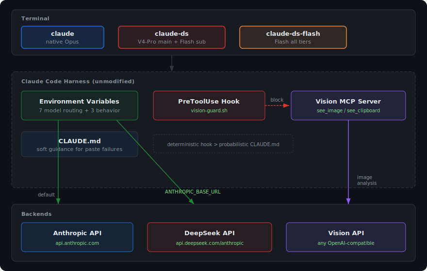
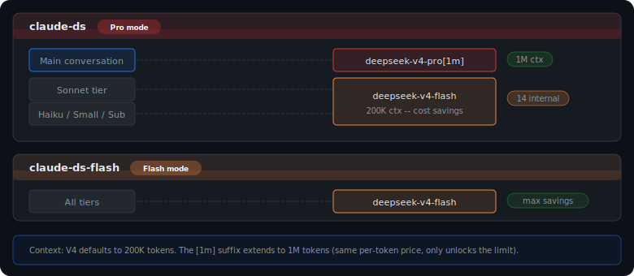
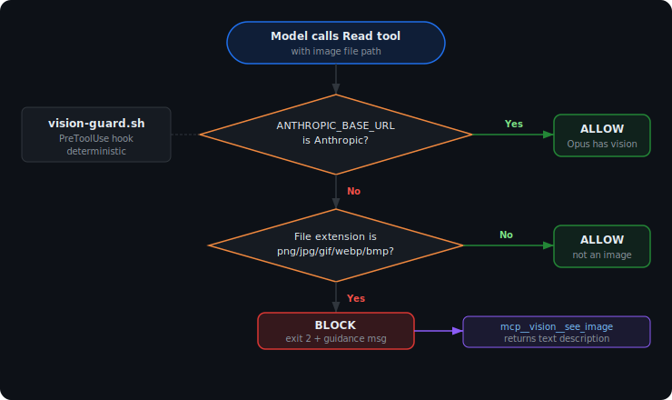

# claude-ds

**English** | [中文](./README.zh-CN.md)

> Use DeepSeek V4 as a drop-in backend for [Claude Code](https://code.claude.com/docs/en/overview) -- same tool, fraction of the cost.

## What is this?

[Claude Code](https://code.claude.com/docs/en/overview) is Anthropic's AI coding assistant that runs in your terminal -- it reads your codebase, edits files, runs commands, and manages Git. It's excellent, but the default model (Claude Opus) costs **$25 per million output tokens**.

**claude-ds** lets you run Claude Code with [DeepSeek V4](https://api-docs.deepseek.com/) as the backend instead. You get the same tool, same workflow, same built-in tools -- just **~7-89x cheaper** depending on model and current promotions.

| Model | Output cost (per 1M tokens) | Relative to Opus |
|-------|:---------------------------:|:----------------:|
| Claude Opus 4.6 | $25.00 | 1x |
| DeepSeek V4-Pro | $3.48 | **~7x cheaper** |
| DeepSeek V4-Flash | $0.28 | **~89x cheaper** |

## Prerequisites

1. **Claude Code CLI** -- `curl -fsSL https://claude.ai/install.sh | bash` or `npm install -g @anthropic-ai/claude-code` ([docs](https://code.claude.com/docs/en/overview))
2. **DeepSeek API key** -- get one at [platform.deepseek.com](https://platform.deepseek.com/api_keys)
3. **Python 3.10+** -- needed if you want vision support (optional)

## Quick start

```bash
# 1. Clone
git clone https://github.com/danielzhangau/claude-ds.git
cd claude-ds

# 2. Install (interactive -- prompts for API keys)
./install.sh

# 3. Restart your shell
source ~/.zshrc  # or ~/.bashrc

# 4. Use it
claude-ds          # V4-Pro -- complex coding, architecture, refactoring
claude-ds-flash    # V4-Flash -- quick fixes, simple tasks
```

That's it. `claude-ds` and `claude-ds-flash` are drop-in replacements for the `claude` command. Everything you know about Claude Code (slash commands, `/compact`, Agent tool, hooks, MCP servers) works the same way. See [Known limitations](#known-limitations) for edge cases.

## What's included

| Component | What it does |
|-----------|-------------|
| **Shell functions** | `claude-ds` and `claude-ds-flash` commands with optimized env vars |
| **Vision MCP server** | Gives text-only models the ability to see images (optional) |
| **Vision guard hook** | Automatically redirects image reads to the Vision MCP |
| **One-line installer** | Sets everything up interactively |

## How it works

The `claude-ds` command is a thin wrapper that launches `claude` with environment variables pointing to DeepSeek's API instead of Anthropic's. Claude Code doesn't know or care -- DeepSeek provides an [Anthropic-compatible endpoint](https://api-docs.deepseek.com/guides/anthropic_api).

<p align="center">
  
</p>

**Two modes:**
- **`claude-ds`** (Pro mode) -- V4-Pro for the main conversation (1M context), V4-Flash for internal tasks. Best for complex work.
- **`claude-ds-flash`** (Flash mode) -- V4-Flash for everything. Maximum cost savings.

<p align="center">
  
</p>

<details>
<summary><strong>Environment variables (advanced)</strong></summary>

These variables were identified by reverse-engineering Claude Code v2.1.71's binary. The critical ones missing from most third-party setups are marked.

| Variable | Purpose | Default risk if unset |
|----------|---------|----------------------|
| `ANTHROPIC_BASE_URL` | Route to DeepSeek endpoint | Uses Anthropic (fails without subscription) |
| `ANTHROPIC_AUTH_TOKEN` | DeepSeek API key | Auth failure |
| `ANTHROPIC_MODEL` | Primary conversation model | Uses Claude model name (API error) |
| `ANTHROPIC_DEFAULT_OPUS_MODEL` | Opus tier mapping | Uses `claude-opus-*` |
| `ANTHROPIC_DEFAULT_SONNET_MODEL` | Sonnet tier mapping | Uses `claude-sonnet-*` |
| `ANTHROPIC_DEFAULT_HAIKU_MODEL` | Haiku tier mapping | Uses `claude-haiku-*` |
| **`ANTHROPIC_SMALL_FAST_MODEL`** | **Internal lightweight tasks (many refs in binary)** | **Uses `claude-haiku-*` -- silent failures** |
| `CLAUDE_CODE_SUBAGENT_MODEL` | Agent tool subagents | Falls back to Sonnet tier |
| `CLAUDE_CODE_MAX_RETRIES` | API retry on 503 | 0 retries (immediate failure) |
| `CLAUDE_CODE_DISABLE_LEGACY_MODEL_REMAP` | Prevent model name remapping | May corrupt `deepseek-v4-*` names |
| `CLAUDE_CODE_EFFORT_LEVEL` | Thinking depth | `auto` (DeepSeek recommends `max`) |

You don't need to set these manually -- `install.sh` handles everything. This table is for understanding what's happening under the hood.

</details>

<details>
<summary><strong>Vision MCP server (optional)</strong></summary>

DeepSeek V4 is text-only -- it can't see images. The Vision MCP server bridges this gap by routing image analysis to any OpenAI-compatible vision model.

**Two tools:**

| Tool | Description |
|------|-------------|
| `see_image` | Analyze an image file on disk (absolute path) |
| `see_clipboard` | Analyze the image currently in the system clipboard |

Both accept an optional `question` parameter. If omitted, returns a thorough description. If provided, answers that specific question about the image.

**Supported vision backends:**

Any OpenAI-compatible vision API works. Examples:

| Provider | Model | Endpoint |
|----------|-------|----------|
| Alibaba Cloud (Bailian) | `qwen3-vl-plus` | `https://dashscope.aliyuncs.com/compatible-mode/v1` |
| OpenAI | `gpt-4o` | `https://api.openai.com/v1` |
| Groq | `meta-llama/llama-4-scout-17b-16e-instruct` | `https://api.groq.com/openai/v1` |
| Local (Ollama) | `llama3.2-vision` | `http://localhost:11434/v1` |

**Vision guard hook:**

The `vision-guard.sh` PreToolUse hook provides deterministic enforcement -- when the model tries to `Read` an image file, the hook blocks it and redirects to `see_image` instead. This is more reliable than CLAUDE.md instructions alone.

<p align="center">
  
</p>

Key properties:
- Intercepts `Read` tool calls for image files (`.png`, `.jpg`, `.jpeg`, `.gif`, `.webp`, `.bmp`)
- Only activates when `ANTHROPIC_BASE_URL` points to a non-Anthropic endpoint
- Returns exit code 2 with instructions to use `see_image` instead
- **No-op for native Claude Opus** (which has built-in multimodal vision)

</details>

## Known limitations

| Limitation | Workaround |
|------------|------------|
| Ctrl+V image paste may cause 400 error on text-only backends | Save image to file, use `see_image`; or use `see_clipboard` |
| Session may be corrupted after image paste error ([#19031](https://github.com/anthropics/claude-code/issues/19031)) | `/rewind` or Esc twice to step back; if unrecoverable, start a new session |
| DeepSeek API 503 during peak hours | `MAX_RETRIES=3` handles this automatically |
| Coherence may degrade past 500K tokens | Use `/compact` in long sessions |
| V4 thinking mode `reasoning_content` may 400 in multi-turn | Restart session if this occurs |
| `claude-ds` cannot `/resume` sessions from `claude` (different backends) | Not fixable -- different API endpoints |
| No native auto-fallback from Anthropic to DeepSeek | Not supported -- use `claude-ds` or `claude` separately |

## Uninstall

```bash
./install.sh --uninstall
```

Or manually:
1. Remove the `claude-ds` / `claude-ds-flash` functions from `~/.zshrc` (or `~/.bashrc`)
2. Remove `"vision"` entry from `~/.claude.json` (under `mcpServers`)
3. Remove `"vision-guard"` hook from `~/.claude/settings.json`
4. Remove `"mcp__vision"` from permissions in `~/.claude/settings.json`
5. Remove Vision MCP lines from `~/.claude/CLAUDE.md`

## License

MIT

## Credits

- [Claude Code](https://code.claude.com/docs/en/overview) by Anthropic
- [DeepSeek V4](https://api-docs.deepseek.com/) by DeepSeek
- Vision MCP server forked from [clipboard-vision-mcp](https://github.com/Capetlevrai/clipboard-vision-mcp) by Capetlevrai
