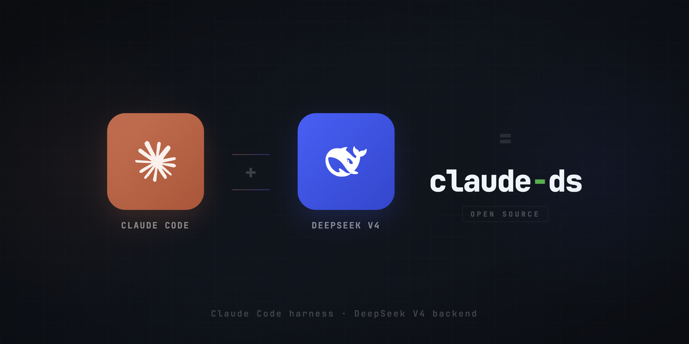

# claude-ds

[English](./README.en.md) | **中文**

<p align="center">
  
</p>

> 用 DeepSeek 平替 Claude Code 的默认后端 -- 一样的体验，几分之一的价格。

## 这是什么?

[Claude Code](https://code.claude.com/docs/en/overview) 是 Anthropic 做的终端 AI 编程助手 -- 能读代码、改文件、跑命令、管 Git，体验很好。但默认用的 Claude Opus 模型，输出要 **$25 / 百万 token**，用起来肉疼。

**claude-ds** 是一个低成本方案：把后端换成 [DeepSeek V4](https://api-docs.deepseek.com/)，工具、工作流、内置功能全都不变，**省 7~89 倍的钱**。对于想省钱又不想换工具的开发者来说，这就是 Claude Code 最实用的平替。

| 模型 | 输出价格（每百万 token） | 对比 Opus |
|------|:----------------------:|:---------:|
| Claude Opus 4.6 | $25.00 | 1x |
| DeepSeek V4-Pro | $3.48 | **便宜 ~7x** |
| DeepSeek V4-Flash | $0.28 | **便宜 ~89x** |

## 开始之前

1. **Claude Code CLI** -- `curl -fsSL https://claude.ai/install.sh | bash` 或 `npm install -g @anthropic-ai/claude-code`（[官方文档](https://code.claude.com/docs/en/overview)）
2. **DeepSeek API key** -- 去 [platform.deepseek.com](https://platform.deepseek.com/api_keys) 申请
3. **Python 3.10+** -- 只有用图像识别功能才需要（可选）

## 快速上手

```bash
# 1. 克隆
git clone https://github.com/danielzhangau/claude-ds.git
cd claude-ds

# 2. 安装（交互式，会让你输入 API key）
./install.sh

# 3. 重新加载 shell
source ~/.zshrc  # 或 ~/.bashrc

# 4. 开始用
claude-ds          # V4-Pro -- 复杂编码、架构设计、重构
claude-ds-flash    # V4-Flash -- 小改动、简单任务
```

搞定。`claude-ds` 和 `claude-ds-flash` 可以直接替代 `claude` 命令。Claude Code 的所有功能（斜杠命令、`/compact`、Agent tool、hooks、MCP servers）都正常可用。边界情况见[已知限制](#已知限制)。

> 如果你觉得 Claude Code 好用但嫌贵，又不想折腾换别的工具，试试这个。

## 项目结构

| 组件 | 说明 |
|------|------|
| **Shell 函数** | `claude-ds` / `claude-ds-flash` 命令，配好了环境变量 |
| **Vision MCP 服务器** | 给纯文本模型加上看图能力（可选） |
| **Vision guard hook** | 自动把图片读取拦截并转发给 Vision MCP |
| **一键安装脚本** | 交互式搞定所有配置 |

## 工作原理

`claude-ds` 就是一层薄壳 -- 通过环境变量把 `claude` 的 API 请求指向 DeepSeek 而不是 Anthropic。Claude Code 完全无感，因为 DeepSeek 提供了 [Anthropic 兼容接口](https://api-docs.deepseek.com/guides/anthropic_api)。不需要改代码，不需要装额外的代理，开箱即用。

<p align="center">
  
</p>

**两种模式：**
- **`claude-ds`**（Pro 模式）-- 主对话走 V4-Pro（1M 上下文），内部子任务走 V4-Flash。适合干重活。
- **`claude-ds-flash`**（Flash 模式）-- 全部走 V4-Flash。最省钱。

<p align="center">
  
</p>

<details>
<summary><strong>环境变量（进阶）</strong></summary>

这些变量是逆向 Claude Code v2.1.71 二进制后整理出来的。大部分第三方教程都漏掉了几个关键的，下面标出来了。

| 变量 | 干什么用的 | 不设会怎样 |
|------|-----------|-----------|
| `ANTHROPIC_BASE_URL` | 把请求指向 DeepSeek | 走 Anthropic（没订阅就挂） |
| `ANTHROPIC_AUTH_TOKEN` | DeepSeek API key | 认证失败 |
| `ANTHROPIC_MODEL` | 主对话模型 | 用 Claude 模型名（API 报错） |
| `ANTHROPIC_DEFAULT_OPUS_MODEL` | Opus 层级映射 | 用 `claude-opus-*` |
| `ANTHROPIC_DEFAULT_SONNET_MODEL` | Sonnet 层级映射 | 用 `claude-sonnet-*` |
| `ANTHROPIC_DEFAULT_HAIKU_MODEL` | Haiku 层级映射 | 用 `claude-haiku-*` |
| **`ANTHROPIC_SMALL_FAST_MODEL`** | **内部轻量任务（二进制里大量引用）** | **用 `claude-haiku-*` -- 悄悄出错** |
| `CLAUDE_CODE_SUBAGENT_MODEL` | Agent tool 的子代理模型 | 回退到 Sonnet 层级 |
| `CLAUDE_CODE_MAX_RETRIES` | API 503 时重试次数 | 不重试（直接失败） |
| `CLAUDE_CODE_DISABLE_LEGACY_MODEL_REMAP` | 阻止模型名被自动改写 | 可能把 `deepseek-v4-*` 改坏 |
| `CLAUDE_CODE_EFFORT_LEVEL` | 思考深度 | `auto`（DeepSeek 建议用 `max`） |

这些不用手动配 -- `install.sh` 全部搞定了。这张表只是方便你了解底层在干嘛。

</details>

<details>
<summary><strong>Vision MCP 服务器（可选）</strong></summary>

DeepSeek V4 是纯文本模型，看不了图。Vision MCP 服务器把看图请求转发给支持视觉的模型（任何 OpenAI 兼容接口都行），补上这块短板。

**两个工具：**

| 工具 | 说明 |
|------|------|
| `see_image` | 看磁盘上的图片文件（传绝对路径） |
| `see_clipboard` | 看系统剪贴板里的图片 |

都支持可选的 `question` 参数 -- 不传就返回完整描述，传了就针对性回答。

**支持的视觉后端：**

只要是 OpenAI 兼容的视觉 API 就行，举几个例子：

| 厂商 | 模型 | Endpoint |
|------|------|----------|
| 阿里云百炼 | `qwen3-vl-plus` | `https://dashscope.aliyuncs.com/compatible-mode/v1` |
| OpenAI | `gpt-4o` | `https://api.openai.com/v1` |
| Groq | `meta-llama/llama-4-scout-17b-16e-instruct` | `https://api.groq.com/openai/v1` |
| 本地 Ollama | `llama3.2-vision` | `http://localhost:11434/v1` |

**Vision guard hook：**

`vision-guard.sh` 是一个 PreToolUse hook -- 模型想用 `Read` 读图片时，hook 直接拦下来，让它改用 `see_image`。比光靠 CLAUDE.md 里写提示词靠谱多了。

<p align="center">
  
</p>

具体行为：
- 拦截对图片文件（`.png`、`.jpg`、`.jpeg`、`.gif`、`.webp`、`.bmp`）的 `Read` 调用
- 只在 `ANTHROPIC_BASE_URL` 指向非 Anthropic 端点时生效
- 返回 exit code 2，附带"请用 `see_image`"的提示
- **原生 Claude Opus 不受影响**（它自带多模态能力，不需要这个）

</details>

## 已知限制

| 问题 | 怎么办 |
|------|--------|
| Ctrl+V 粘贴图片可能在纯文本后端报 400 | 把图片存成文件再用 `see_image`；或用 `see_clipboard` |
| 粘贴图片报错后会话可能坏掉（[#19031](https://github.com/anthropics/claude-code/issues/19031)） | `/rewind` 或连按两次 Esc 回退；不行就开新会话 |
| DeepSeek API 高峰期 503 | `MAX_RETRIES=3` 会自动重试 |
| 超过 500K token 后回答质量可能下降 | 长会话记得用 `/compact` 压缩上下文 |
| V4 thinking 模式 `reasoning_content` 多轮后可能 400 | 重启会话 |
| `claude-ds` 不能 `/resume` 用 `claude` 开的会话 | 没法解决 -- 后端不一样 |
| 不支持 Anthropic/DeepSeek 自动切换 | 只能手动选 `claude-ds` 或 `claude` |
| 挪了仓库目录后安装会失效 | 重跑 `./install.sh` |

## 卸载

```bash
./install.sh --uninstall
```

或者手动清理：
1. 从 `~/.zshrc`（或 `~/.bashrc`）删掉 `claude-ds` / `claude-ds-flash` 函数
2. 从 `~/.claude.json` 删掉 `mcpServers` 里的 `"vision"` 项
3. 从 `~/.claude/settings.json` 删掉 `"vision-guard"` hook
4. 从 `~/.claude/settings.json` 删掉 permissions 里的 `"mcp__vision"`
5. 从 `~/.claude/CLAUDE.md` 删掉 Vision MCP 相关内容

## 许可证

MIT

---

*所有产品名称、标识和品牌均为其各自所有者的财产。使用这些名称不代表获得任何背书。*

## 致谢

- [Claude Code](https://code.claude.com/docs/en/overview) -- Anthropic
- [DeepSeek V4](https://api-docs.deepseek.com/) -- DeepSeek
- Vision MCP server 基于 [clipboard-vision-mcp](https://github.com/Capetlevrai/clipboard-vision-mcp)（Capetlevrai）
